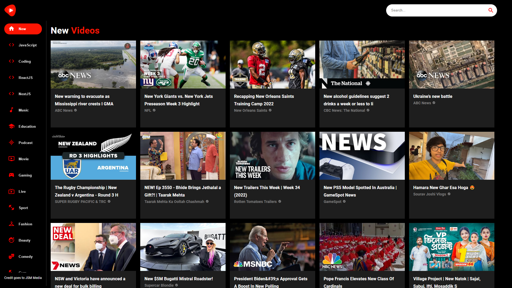
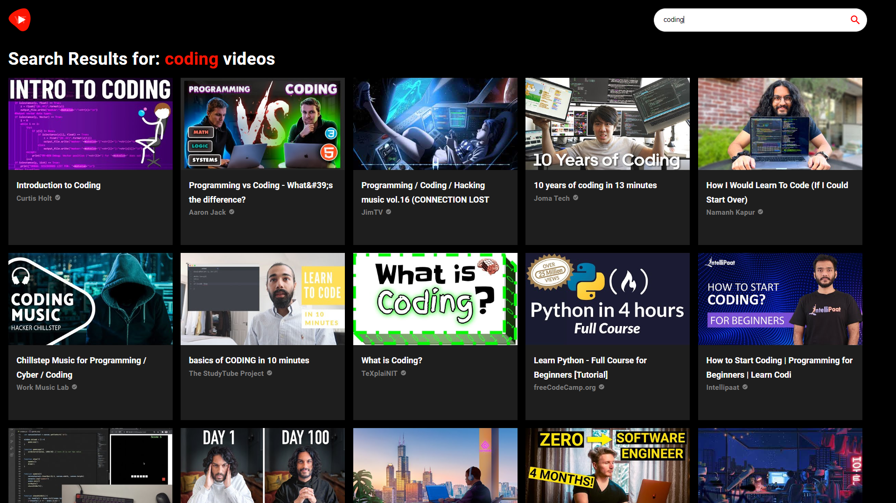
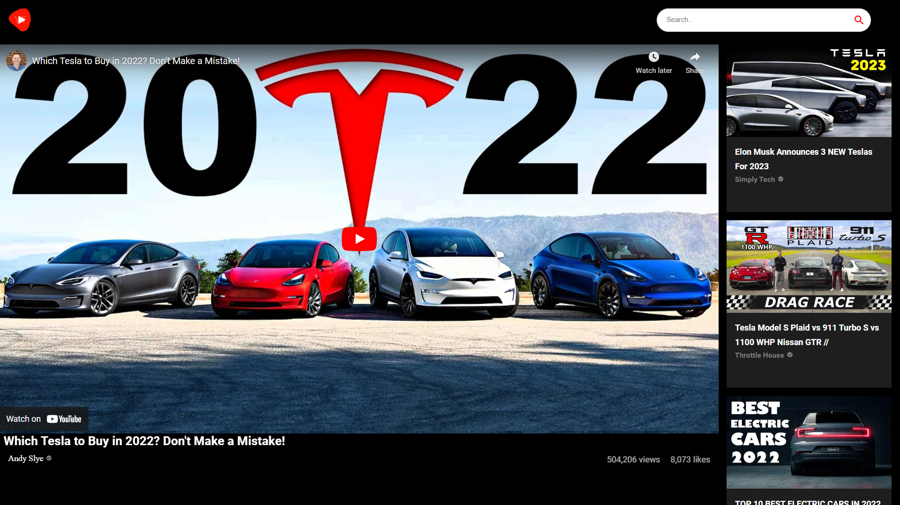
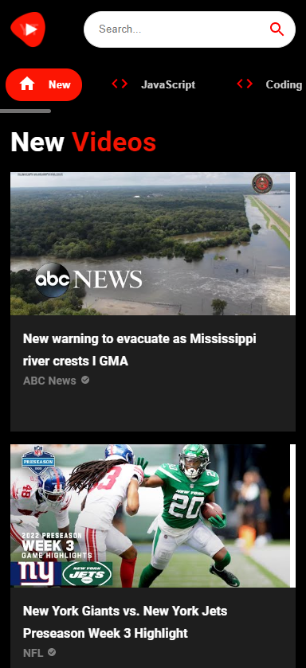
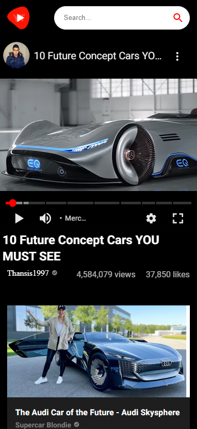

# YouTube_Clone

The YouTube clone offers users a different user interface with search functionality,
category selections, and many other features, and it's fully responsive to any device..

### Tech Stack

`HTML` `CSS` `JavaScript` `React` `Material UI`

 

### App Screenshots

**`DESKTOP VIEW`**

**`MOBILE VIEW`**
 

#### Demo

https://youtube-clone-by-arbaz.netlify.app/
